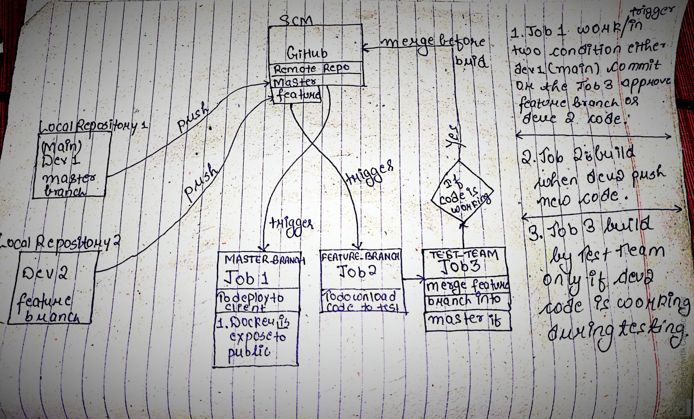

# Task May 5 2020
**Introduction** *The object is to deploy a website to client after QAT (Quality Assurance Testing) approved it after testing the code of developer(karan-branch) in my case. After the QAT approved the code the merge occour of feature-branch(karan) into master branch.*

*We used Git-Bash to work on code and save it in local repository. The master branch is connected to production environment that deploy the site directly to client*

*The feature-branch(karan) code is update by another developer and when he commit the code, itb automatically push to remote repository using hooks concept "post-commit".*

*The QAT donload the code in their local folder test the code under same condition as client. And build accordingly to result.*

**Work Flow Of This Project**

**Configuration of Master Branch Job-1**
*The work of **Job 1** is to deploy code directly to client*

**Working** :- *When Developer push code through master branch or when the QAT approved the code of feature-branch( merger the code in into master branch code) it download the code into its workspace*
*After it checks for the container i.e, if the container is not available it run the command to run conatiner first*
*The docker container is mount with local folder with path /root/pro, the jenkins copy the post into this local folder*

**Configuration of Feature Branch Job-2**
**working** :- "When second-developer commit the change to feature branch, the **Job-2** trigger, download the code into its worksapce and copy it to test folder of test-environment*

**Configuration of Test Team Job 3**
**working** :- *After deployin the code into local enviroment, if they fee the code in updates and working fine, the **Job-3** comes into play tell the GitHub to merge the featurebranch code into master that trigger the **Job-1** and the site is deployed to client*

**Working video available on Linkedin**
[Post-Link](https://www.linkedin.com/posts/karan-maheshwari-9b69871a1_linuxworld-righteducation-devopstools-activity-6664101514371563520-juoA)
